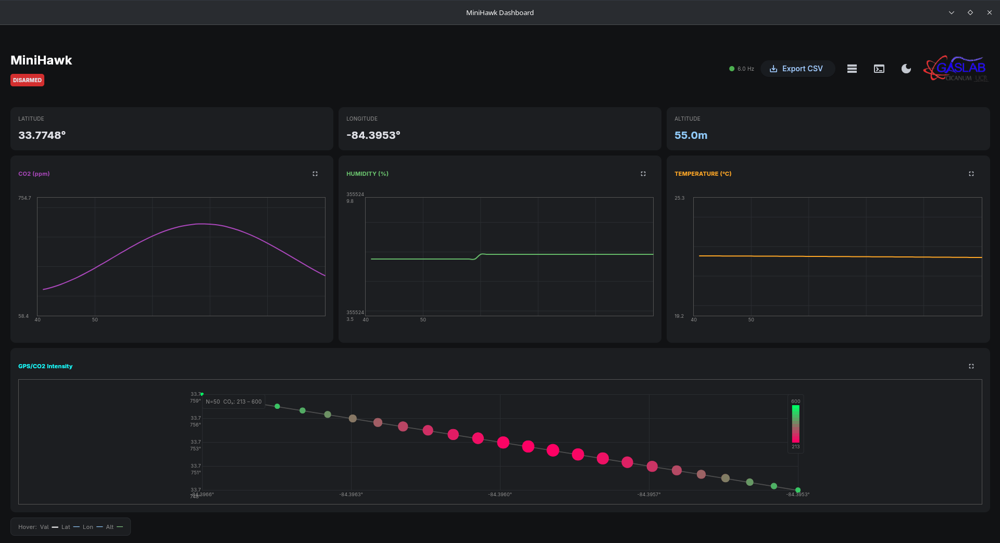
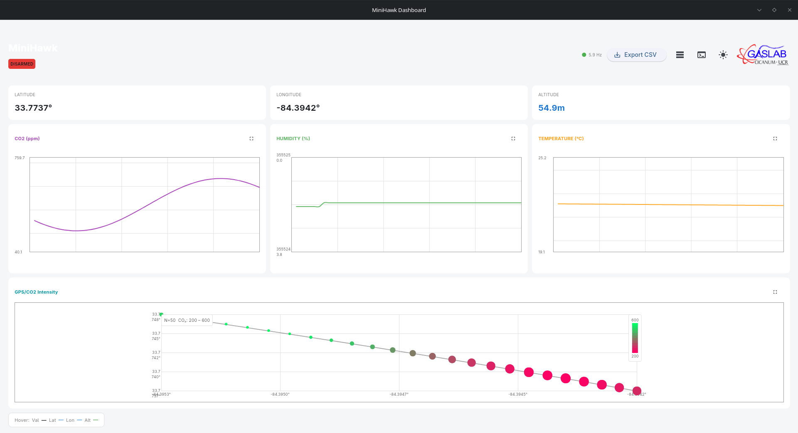

# MiniHawk

<p align="center">
  
</p>

MiniHawk is a cross-platform telemetry dashboard for UAV environmental sensing. It receives sensor data via MAVLink (UDP), visualizes live CO₂, humidity, temperature, H₂S, SO₂, and CO₂ (fine) on line charts, renders a 3D terrain + GPS/CO₂ scatter plot, and supports dark/light mode, data export, band configuration, offline terrain caching, and maximizable chart dialogs.

## Features

- **Real-time MAVLink telemetry** over configurable UDP address
- **6 live line charts** — CO₂ (ppm), humidity (%), temperature (°C), H₂S (ppm), SO₂ (ppm), CO₂ fine (ppm) — with configurable color bands
- **3D terrain scatter plot** — Matplotlib-rendered SRTM terrain mesh with GPS/CO₂ points floating at true altitude, coolwarm colormap + colorbar
- **Offline terrain download** — pre-cache SRTM elevation tiles for any bounding box with progress tracking and terrain preview
- **Dark & light themes** with automatic OS detection and manual toggle
- **Settings dialog** to change MAVLink connection address at runtime
- **Band configuration** — per-sensor color bands with editable thresholds, labels, and colors
- **Adaptive CSV export** — share sheet on mobile, save dialog on desktop
- **Persistent config & theme** saved to `config.json` and `theme.json`
- **Resilient connection handling** with auto-reconnect and exponential backoff
- **Maximizable charts** via fullscreen dialog popups
- **Cross-platform builds** — Linux, Windows, macOS, Android via [Flet](https://flet.dev)

## System Architecture

```
┌─────────────┐      MAVLink      ┌─────────────────────────────┐
│  Autopilot   │  NAMED_VALUE_FLOAT│   MiniHawk Dashboard        │
│   / UAV     │◄─────────────────►│  (Flet + flet-charts GUI)   │
└─────────────┘   GLOBAL_POSITION │  Receives UDP on port 14550 │
        │         HEARTBEAT       └─────────────────────────────┘
        │
        ▼
┌─────────────┐
│    ESP32    │  SEN66 (I²C): CO₂ / humidity / temp
│  (Serial1)  │  4-20mA (ADC): H₂S / SO₂ / CO₂ fine
└─────────────┘  + logs to SD card + test sine wave
```

## Dashboard Screenshots

<!-- Replace the placeholder paths with your actual screenshot files -->

<p align="center">
  
  <br>
  <em>Dark Mode Dashboard</em>
</p>

<p align="center">
  
  <br>
  <em>Light Mode Dashboard</em>
</p>

## Prerequisites

- Python 3.12+
- pip
- Git
- For **building**: Flutter / Flet CLI and platform SDKs (see [Build](#build) below)
- For **firmware**: Arduino IDE or PlatformIO with ESP32 board support

## Virtual Environment Setup

```bash
# Clone the repository
git clone https://gitlab.com/AleG911/minihawk.git
cd minihawk

# Create a virtual environment
python3 -m venv venv

# Activate it
# Linux / macOS:
source venv/bin/activate
# Windows:
venv\Scripts\activate

# Install dependencies
pip install -r requirements.txt
```

Dependencies include:
- `flet==0.83.0`
- `flet-charts==0.83.0`
- `pymavlink`
- `srtm.py`
- `scipy`
- `matplotlib`

## Running the App

With the virtual environment activated and dependencies installed:

```bash
# Run directly from source
python main.py
```

The dashboard will open and begin listening for MAVLink messages on **UDP port 14550** (all interfaces by default). You can change the bind address and port from the **Settings** gear button.

> **Tip:** The app auto-detects your OS theme on first launch and saves the preference to `theme.json`. MAVLink config is saved to `config.json`.

> **Network setup:** The dashboard uses a **listening UDP socket** (`udpin:`). This means the *sender* (autopilot, fake sender, or Mission Planner) must be configured to **send UDP packets TO your device's IP and port**. For example, if your phone is on WiFi at `192.168.1.50`, set *Bind address* = `192.168.1.50` and *Port* = `14550`, then configure the sender to target `udp:192.168.1.50:14550`.

## Build

MiniHawk is configured as a Flet cross-platform application in `pyproject.toml`.

### Linux

A convenience script is provided that patches a known Python header issue before building:

```bash
# Review and adjust the hardcoded header path inside tools/build-script.sh first
bash tools/build-script.sh
```

Or build manually:

```bash
# Add --skip-flutter-doctor to skip post-failure doctor output
flet build linux --skip-flutter-doctor
```

### Other Platforms

```bash
# macOS
flet build macos --skip-flutter-doctor

# Windows
flet build windows --skip-flutter-doctor

# Android (INTERNET permission is included by default)
# For WiFi state add: --android-permissions "android.permission.ACCESS_WIFI_STATE=true"
flet build apk --skip-flutter-doctor [--android-permissions "android.permission.ACCESS_WIFI_STATE=true"]
```

For detailed build requirements per platform, see the [Flet packaging docs](https://flet.dev/docs/publish).

## Firmware

The reference firmware (`firmware/main.ino`) is an **ESP32 Arduino** sketch that:

- Reads a **Sensirion SEN66** sensor via I²C (temperature, humidity, CO₂)
- Reads three **4-20mA analog sensors** via ADC for H₂S (100 ppm FS), SO₂ (50 ppm FS), and CO₂ fine (3000 ppm FS)
- Transmits all 6 values as `NAMED_VALUE_FLOAT` MAVLink messages over **Serial1**
- Logs readings to an **SD card** (`/datalog.csv`)
- Sends a test sine wave (`TEST_SINE`) for verification

### Wiring / Pinout

| Signal | ESP32 Pin |
|--------|-----------|
| I2C SDA | GPIO 21 |
| I2C SCL | GPIO 22 |
| Serial1 TX | GPIO 17 |
| Serial1 RX | GPIO 16 |
| SD CS | GPIO 2 |
| H₂S (4-20mA) | GPIO 26 |
| SO₂ (4-20mA) | GPIO 27 |
| CO₂ Fine (4-20mA) | GPIO 14 |

### Flashing

1. Install the **Sensirion SEN66 Arduino library** and **MAVLink Arduino library** via the Library Manager.
2. Select your ESP32 board in the Arduino IDE.
3. Open `firmware/main.ino`.
4. Build and upload.

The firmware streams `TEMP`, `HUMIDITY`, `CO2`, `H2S`, `SO2`, `CO2_FINE`, and `TEST_SINE` at 2-second intervals.

## Project Structure

```
minihawk/
├── main.py                    # Entry point — Flet GUI + MAVLink listener
├── requirements.txt           # Python dependencies
├── pyproject.toml             # Flet packaging configuration
├── theme.json                 # Saved theme preference (auto-created)
├── config.json                # Saved MAVLink + band config (auto-created)
├── elevation_cache/           # SRTM .hgt terrain tiles (auto-populated)
├── assets/
│   ├── logo.png               # App branding
│   └── icon.png               # Build icon
├── tools/
│   ├── build-script.sh        # Linux build helper with header patch
│   ├── requirements.txt       # Dev / tool dependencies
│   └── fake_mavlink_sender.py # Test utility — synthetic 6-sensor telemetry
└── firmware/
    └── main.ino               # Reference ESP32 firmware (SEN66 + 4-20mA)
```

## License

See [LICENSE](LICENSE).
